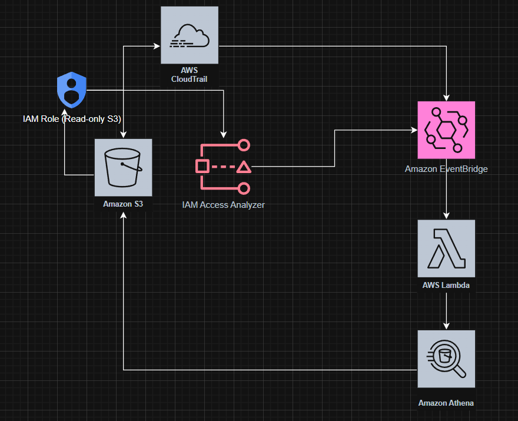

# AWS Learning Journey

This repo documents my hands-on learnings and experiments while exploring AWS cloud services.  
I’m focusing on building secure, automated, and scalable solutions.

##  What I’ve Done / Am Doing

- **IAM Role-Based Access**  
  - Created and assumed a read-only S3 role using temporary **STS** credentials.  
  - Validated least-privilege and secure access patterns.

- **CloudTrail & IAM Access Analyzer**  
  - Enabled **CloudTrail** to capture IAM role usage.  
  - Generated least-privilege policies using **IAM Access Analyzer**.

- **Event-Driven Automation**  
  - Automated data refresh using **EventBridge scheduled events** to trigger a **Lambda** function.

- **IAM Best Practices**  
  - Applied least-privilege access across **S3**, **Lambda**, and **Athena**.

---

##  Next Steps / To-Do

- Explore **Amazon EC2** for compute workloads.  
- Set up a **VPC** to understand networking, subnets, and security groups.  
- Work with **Amazon RDS** for managed relational databases.  
- Practice querying and visualizing data with **Athena + QuickSight**.  
- Implement **CloudWatch alarms and dashboards** for monitoring.  
- Experiment with **AWS CDK/Terraform** for Infrastructure as Code.  

---

##  Architecture

 More experiments and notes will be added here as I continue learning AWS!  
